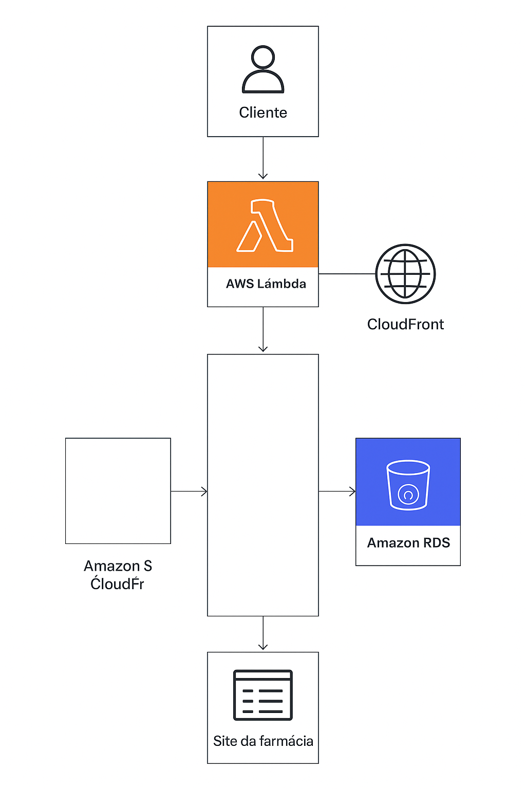

# 💊 Plataforma de Farmácia na AWS — Abstergo Industries

---

## 📖 Sobre o Projeto
Este repositório contém a implementação de uma **plataforma virtual de farmácia**, criada como desafio da **DIO**.  
O objetivo foi projetar uma arquitetura **escalável, segura e de baixo custo** na AWS, aplicando serviços cloud de forma prática.

---

## 🏗️ Arquitetura da Solução
A arquitetura foi desenhada para ser **serverless e altamente disponível**, utilizando:

- **Amazon S3 + CloudFront** → Hospedagem estática e distribuição global do site.
- **Amazon RDS (MySQL)** → Banco relacional para usuários, produtos e pedidos.
- **AWS Lambda + API Gateway** → Backend para processamento de pedidos e integração de pagamentos.

📌 **Diagrama da arquitetura:**

---

## 📂 Estrutura do Repositório

.
├── RELATORIO_IMPLEMENTACAO_AWS.md # Relatório detalhado de implementação
├── README.md # Este arquivo
├── assets/
│ └── diagrama_arquitetura.png # Diagrama de arquitetura AWS
├── sql/
│ └── schema_mysql.sql # Script SQL para inicializar banco RDS
├── lambda/
│ ├── index.js # Função Lambda de exemplo
│ └── package.json # Dependências da Lambda
├── api/
│ └── openapi.yaml # Especificação OpenAPI da API
└── .gitignore

---

## 🚀 Como Executar
1. **Frontend** → Faça upload do site estático no **S3** e distribua com **CloudFront**.
2. **Banco de Dados** → Crie uma instância **RDS MySQL** e rode o script `sql/schema_mysql.sql`.
3. **Backend** → Faça deploy da função **Lambda** (`lambda/`) e configure endpoints no **API Gateway** conforme `api/openapi.yaml`.

---

## ✅ Benefícios da Arquitetura
- 📉 **Redução de custos** com serviços sob demanda (S3, Lambda).  
- ⚡ **Escalabilidade automática** em picos de acesso.  
- 🔒 **Segurança** (IAM, backups automáticos, criptografia).  
- 🌎 **Baixa latência** com distribuição global (CloudFront).  

---

## 📌 Próximos Passos
- Implementar **Amazon SNS** → Notificações de pedidos.  
- Criar dashboards em **Amazon QuickSight** → Relatórios de vendas.  
- Adicionar monitoramento com **CloudWatch** → Logs e métricas da aplicação.  

---

## 👨‍💻 Autor
**Pablo Fernandes**  
📧 [Seu Email]  
🔗 [LinkedIn](https://linkedin.com/in/pablo-fernandes-7b0445125?)  
🐙 [GitHub](https://github.com/pabloafer10)

---

## 📝 Licença
Este projeto está licenciado sob a licença **MIT**.  
Sinta-se livre para usar, estudar e melhorar! 🚀

